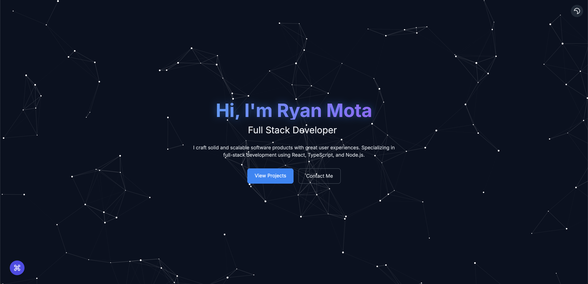

# Ryan Mota's Portfolio

[](https://ryanmota.dev)

[](https://nextjs.org/)
[](https://www.typescriptlang.org/)
[](https://tailwindcss.com/)
[](https://vercel.com)

Welcome to my portfolio website repository! This is a modern, responsive portfolio showcasing my projects, skills, and experience as a software developer. Visit the live site at [ryanmota.dev](https://ryanmota.dev)

## 🎯 Project Highlights

- **Modern Tech Stack**: Built with Next.js 14, TypeScript, and Tailwind CSS
- **Performance Focused**: Optimized for speed with 90+ Lighthouse scores
- **User Experience**: Intuitive navigation with command palette (⌘K)
- **Responsive Design**: Seamless experience across all devices
- **Dark Mode**: Easy on the eyes with automatic theme detection
- **Analytics**: Built-in visitor tracking and performance monitoring

## 🌟 Key Features

- 🎨 Clean, minimalist design
- 📱 Mobile-first approach
- 🌙 Dark/Light mode toggle
- ⚡ Blazing fast page loads
- 🎭 Smooth page transitions
- 🎯 SEO optimized
- 📊 Real-time analytics
- 🔍 Quick search functionality
- 🔄 Continuous deployment

## 🛠 Tech Stack

- **Framework**: [Next.js 14](https://nextjs.org/) with App Router
- **Language**: [TypeScript](https://www.typescriptlang.org/)
- **Styling**: [Tailwind CSS](https://tailwindcss.com/)
- **Animations**: [Framer Motion](https://www.framer.com/motion/)
- **Icons**: [React Icons](https://react-icons.github.io/react-icons/)
- **Analytics**: [Vercel Analytics](https://vercel.com/analytics)
- **Deployment**: [Vercel](https://vercel.com)

## 🚀 Development

1. Clone the repository:
   ```bash
   git clone https://github.com/yourusername/portfolio.git
   cd portfolio
   ```

2. Install dependencies:
   ```bash
   npm install
   ```

3. Start the development server:
   ```bash
   npm run dev
   ```

4. Visit [http://localhost:3000](http://localhost:3000)

## 📈 Performance

- 90+ Performance score on Lighthouse
- Optimized image loading
- Efficient component rendering
- Minimal bundle size
- Fast page transitions

## 🔗 Quick Links

- **Live Site**: [ryanmota.dev](https://ryanmota.dev)
- **Portfolio Status**: [](https://ryanmota.dev)

## 📄 License

This project is licensed under the MIT License - see the [LICENSE](LICENSE) file for details.

---
Designed & Built with ❤️ by Ryan Mota | [ryanmota.dev](https://ryanmota.dev)
